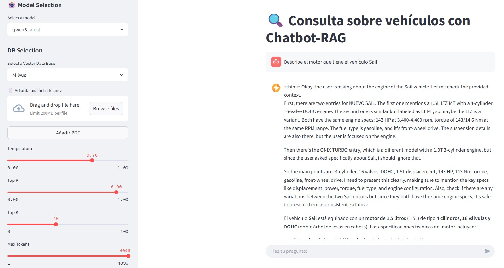

# :car: Chatbot RAG para Fichas Técnicas de Automóviles
Este proyecto implementa un chatbot especializado en fichas técnicas de automóviles, utilizando la arquitectura RAG (Retrieval Augmented Generation). Combina la potencia de un modelo de lenguaje grande con la capacidad de recuperar información técnica precisa de documentos PDF cargados por el usuario, generando respuestas contextualizadas. Desarrollado con Streamlit, LangChain y Ollama.

---

### :file_folder: Estructura del Proyecto
```
📁 backend
|── 📁 app
│   ├── 📁 api
│   │   ├── __init__.py
│   │   ├── routes.py
│   │   └── schemas.py
│   ├── 📁 core
│   │   ├── __init__.py
│   │   ├── config.py
│   │   ├── exceptions.py
│   │   └── utils.py
│   ├── 📁 data_processing
│   │   ├── __init__.py
│   │   └── text_extractor_txt.py
│   ├── 📁 embeddings
│   │   ├── __init__.py
│   │   ├── chroma_db
│   │   ├── FAISS_db.py
│   │   ├── milvus_db.py
│   │   ├── Qdrant_db.py
│   │   └── service.py
│   ├── 📁 llm
│   │   ├── __init__.py
│   │   ├── clients.py
│   │   ├── historical.py
│   │   ├── manager.py
│   │   ├── prompts.py
│   │   └── rag.py
│   └── main.py
├── 📁 data
│   ├── 202411-01-sail.pdf
│   ├── 202411-03-onix-turbo.pdf
│   └── 202411-08-tahoe.pdf
├── .dockerignore
├── .gitignore
├── .python-version
├── Dockerfile
├── Makefile
├── pyproject.toml
├── README.md
└── uv.lock
📁 frontend
|── 📁 config
│   ├── config.toml 
│── 📁 public
│   ├── favicon.png
│   ├── logo_dark.png
│   ├── logo_light.png
│   └── logo.png
├── __init__.py
├── .dockerignore
├── .gitignore
├── .python-version
├── Dockerfile
├── main.py
├── Makefile
├── pyproject.toml
├── README.md
└── uv.lock
```
---

## :dart: Prerrequisitos

Antes de iniciar el proyecto, asegúrate de tener instalado lo siguiente:

* **uv**: Un administrador de paquetes de Python rápido, escrito en Rust. Lo usaremos para gestionar las dependencias del proyecto.
    * Sitio web oficial: (https://docs.astral.sh/uv/getting-started/installation/)
* **Ollama**: Una herramienta para ejecutar modelos de lenguaje grandes localmente. Necesitarás descargar e instalar Ollama para poder usar los modelos de IA.
    * Sitio web oficial: (https://ollama.com/)
* **Chocolatey** (Solo para Windows): Un administrador de paquetes para Windows. Si usas Windows, Chocolatey facilita la instalación de herramientas como `make`.
    * Sitio web oficial: (https://chocolatey.org/install)
* **make**: Una utilidad que controla la generación de ejecutables y otros archivos a partir de los archivos fuente de un programa. Lo usaremos para simplificar el proceso de inicio del proyecto.

## Instalación de Prerrequisitos

Sigue las instrucciones de instalación de los sitios web oficiales para cada herramienta según tu sistema operativo:

* **uv**: Consulta la sección de instalación en el sitio web oficial de uv.
* **Ollama**: Descarga e instala la versión adecuada para tu sistema operativo desde el sitio web oficial de Ollama.
* **Chocolatey** (Solo para Windows): Sigue las instrucciones de instalación en el sitio web oficial de Chocolatey.
* **make**:
    * En sistemas basados en Debian/Ubuntu, puedes instalarlo con `sudo apt update && sudo apt install make`.
    * En macOS, generalmente viene incluido con las herramientas de desarrollo Xcode. Si no lo tienes, puedes instalarlas ejecutando `xcode-select --install`.
    * En Windows, si instalaste Chocolatey, puedes instalar make ejecutando `choco install make`.
---

## :hammer_and_wrench: Configuración

Una vez que tengas Ollama instalado, necesitarás descargar un modelo de lenguaje grande y el modelo de embeddings `nomic-embed-text`.

1.  **Descargar un modelo de IA**: Elige un modelo de la librería de Ollama ([https://ollama.com/library](https://ollama.com/library)) y descárgalo usando el comando `ollama pull <nombre_del_modelo>`. Por ejemplo:
    ```bash
    ollama run llama3.2
    ```
    (Puedes reemplazar `llama3.2` con el nombre del modelo que prefieras).

2.  **Descargar el modelo de embeddings `nomic-embed-text`**: Este modelo es necesario para el componente de recuperación del RAG.
    ```bash
    ollama pull nomic-embed-text
    ```
    * Página del modelo `nomic-embed-text` en la librería de Ollama: [https://ollama.com/library/nomic-embed-text](https://ollama.com/library/nomic-embed-text)

3. **🚨 Requisito Obligatorio**: Antes de ejecutar este proyecto, **debes crear una cuenta gratuita o de pago en [ConvertAPI](https://www.convertapi.com/)**. Esta cuenta es indispensable para generar tu **endpoint** y **secreto de autenticación**, los cuales se utilizarán en las funciones de conversión de archivos.

---

## 🧠  Bases de Datos Vectoriales Usadas

Para la indexación y búsqueda semántica de información, este proyecto es compatible con las siguientes bases de datos vectoriales:

| Base de Datos | Tipo | Descripción |
|---------------|------|-------------|
| **Chroma**    | Local | Ideal para desarrollo local o proyectos pequeños. Fácil de configurar. |
| **FAISS**     | Local | Potente y eficiente para grandes volúmenes, desarrollado por Facebook. |
| **Milvus**    | Nube | Altamente escalable, recomendada para producción. [Sitio oficial](https://milvus.io/es) |
| **Qdrant**    | Nube | Basada en Rust, ofrece alta performance. [Sitio oficial](https://qdrant.tech/) |

---

### ☁️ Consideraciones para Bases Vectoriales en la Nube

Para utilizar **Milvus** o **Qdrant** en la nube:

1. **Crea una cuenta en los portales oficiales:**
   - [Milvus Cloud](https://milvus.io/es)
   - [Qdrant Cloud](https://qdrant.tech/)

2. **Crea un clúster** con el nombre que desees desde el panel de administración.

3. Una vez creado, obtendrás un **endpoint HTTP** y un **token de API** que deberás configurar en el archivo `.env`.

---

## ⚙️ Configuración del Entorno (.env)

En la carpeta `backend`, crea un archivo llamado `.env` con la siguiente estructura:

```env
DEBUG=True

OLLAMA_HOST=http://localhost:11434

LANGSMITH_TRACING=True
LANGSMITH_API_KEY=''

CONVERT_API_HTTP=''
CONVERT_API_SECRET=''

MILVUS_END_POINT=''
MILVUS_API=''

QDRANT_END_POINT=''
QDRANT_API=''
```

### 📝 Notas Importantes:

- Reemplaza `CONVERT_API_HTTP=''` por el **endpoint** proporcionado por ConvertAPI (sin las comillas simples).
- Reemplaza `CONVERT_API_SECRET=''` por tu **clave secreta de ConvertAPI**.
- Para bases vectoriales en la nube:
  - Usa `MILVUS_END_POINT` y `MILVUS_API` si usas Milvus.
  - Usa `QDRANT_END_POINT` y `QDRANT_API` si usas Qdrant.

---
    
## :rocket: Instalación e Inicio del proyecto

1.  **Clona este repositorio**:
    ```bash
    git clone https://github.com/SDiaz0415/IAProyecto.git
    cd IAProyecto
    ```

2.  **Clona este repositorio**

    Para iniciar el chatbot se corre en dos partes, ejecuta el siguiente comando en la consola dentro del directorio del backend:

    ```bash
    make run
    ```

    Una vez iniciado el backend dirigite a la carpeta frontend y ejecuta el siguiente comando en la consola dentro del directorio:

    ```bash
    make run
    ```

3.  **Chat Funcionando**
| App resultado |
|------------------|
|  |
